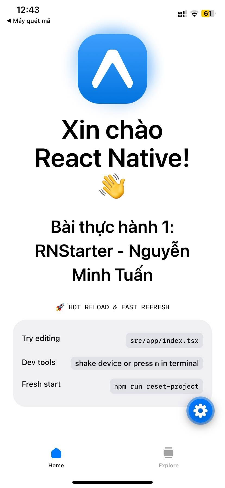

# RNStarter - Thực hành 1: Tạo app khởi động

## 📱 Kết quả thực hành Buổi 1

- **Sinh viên thực hiện**: Nguyễn Minh Tuấn
- **Nội dung**: Khởi tạo dự án RNStarter, chỉnh sửa HomeScreen, kiểm tra Hot Reload & Fast Refresh trên thiết bị.

  

---

Join our community of developers creating universal apps.

- [Expo on GitHub](https://github.com/expo/expo): View our open source platform and contribute.
- [Discord community](https://chat.expo.dev): Chat with Expo users and ask questions.
